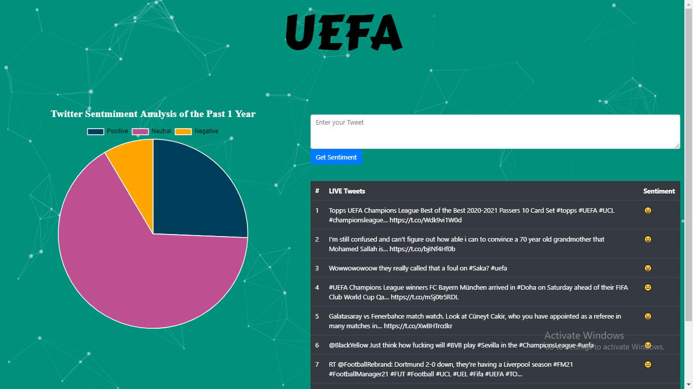

[](#contributors-)
# RealTime-Twitter-Sentiment-Analysis
  A **_Real-time Twitter sentiment analysis_** showcased with the help of **Twitter API's** , **NLTK** and **WORD2VEC**
  
  **You can visit our website [here](https://twitter-sentiment-analysis-znv.herokuapp.com/ "Twitter-Sentiment-Analysis")**

---
## Live Demo
  
  - You will see this home page on visiting the site.
  - Select any topic:
    - **COVID**
    - **BTS**
    - **UEFA**
    - **REACT**
    - **BCCI**
  - On selecting any topic, suppose say **UEFA**, it will open sentiment analysis on **UEFA**
  
  - On the left side, we have chart depicting the percentage of tweets sentiment for over an year.
  - On the right side, we see a text bar, where u can enter tweet to find its sentiment percentage.
  
  - Scroll down to bottom to see live tweets with its sentiment emoji at right. 
  - Enter any tweet in the tweet bar to check its sentiment percentage
  
---
## Technologies Used
### 1. Tweepy API

 - _Tweepy is an open source Python package that gives you a very convenient way to access the Twitter API with Python._
 - It's easy to understand its documentation [here](https://docs.tweepy.org/en/latest/api.html "docs.tweepy.org")
 - To start pulling tweets from tweepy, you need to install tweepy using `!pip install tweepy` and then import as follows: 
 ```python
  import tweepy

  auth=tweepy.OAuthHandler(api_key,api_secret)
  auth.set_access_token(access_token,access_secret)
  api=tweepy.API(auth,wait_on_rate_limit=True)
 ```
- To authorize API, you need to create a **Twitter Developer Account** from [here](https://developer.twitter.com/ "Twitter Developer")
- We used this API for live pulling of tweets and showcasing them on live website
```python
def pull_tweets(query, co=50):
    fetch_tweets = api.search(q="#"+query,count=co)
```
 - To check out full code, click [here](https://github.com/Zeph-T/RealTime-Twitter-Sentiment-Analysis/blob/main/Classes/pulling_tweets.ipynb)
---
### 2. Twint API

  - _"Twint is an advanced tool for Twitter scrapping. We can use this tool to scrape any user’s followers, following, tweets, etc. **without having to use Twitter API**"._
  - You can check out more about **TWINT API** [here](https://github.com/twintproject/twint "ProjectTwint")

  - **Twint API** is more preferable than **Tweepy API** because of its many benifits
    - No restriction in scrapping tweets
    - No hassle in setting up
    - Can be used **anonymously** without Twitter sign-up.
  
  - In this project, we extracted over **3 lakh tweets for 5 topics** via **Twint API** ranging from start of **2020** to present date.
---
### 3. NLTK
  - **NLTK** also known as **Natural Language Toolkit** is the library used mainly for _Natural Language text processing_
  - **NLTK** is used for data cleaning and removal of unnecessary words which doesn't make sense.
  - We use NLTK's stopwords and lemmatizer to clean the unwanted part of tweets.
  ``` python
  from nltk.corpus import stopwords
  from nltk.stem import WordNetLemmatizer
  
  lemm = WordNetLemmatizer()

stop_words = stopwords.words("english")
  ```
  - You can check out whole data cleaning of tweets [here](https://github.com/Zeph-T/RealTime-Twitter-Sentiment-Analysis/blob/main/Classes/Data_cleaning.ipynb "Data Cleaning.ipynb")

### 4. Gensim's Word2Vec model
  - After cleaning of Raw tweets, they are passed into Word2Vec model
  - We import Gensim's Word2Vec model as follows
  ```python
  from gensim.models.phrases import Phrases, Phraser
  from gensim.models import Word2Vec
  from gensim.test.utils import get_tmpfile
  from gensim.models import KeyedVectors
  ```
  - Model is set to the following parameters
  ```python
  w2v_model = Word2Vec(min_count=3,
                     window=4,
                     size=300,
                     sample=1e-5, 
                     alpha=0.03, 
                     min_alpha=0.0007, 
                     negative=20,
                     )

w2v_model.build_vocab(sentences, progress_per=50000)
  ```
  For full code of how to build Word2Vec model, click [here](https://github.com/Zeph-T/RealTime-Twitter-Sentiment-Analysis/blob/main/Classes/Word2vec_model_traning.ipynb)

## Deployment
A basic responsive Flask App which is designed using HTML,CSS, basic JavaScript and Python\
Used ChartJS for better visualisation of Data\
Used TextBlob for getting the sentiment of a user input tweet and visualising the percentage using ChartJS\
Depoyed using Heroku

Link : [Visit our website](https://twitter-sentiment-analysis-znv.herokuapp.com/ "Twitter-Sentiment-Analysis")
